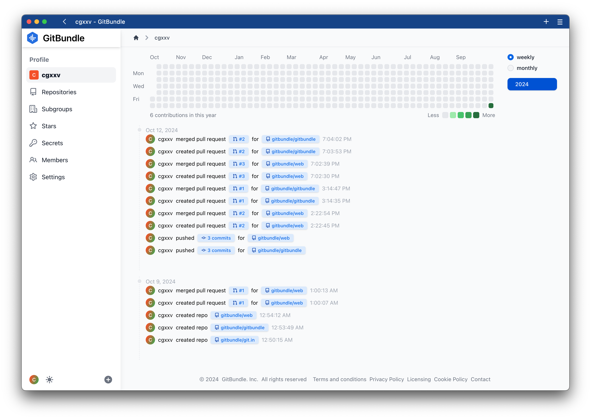
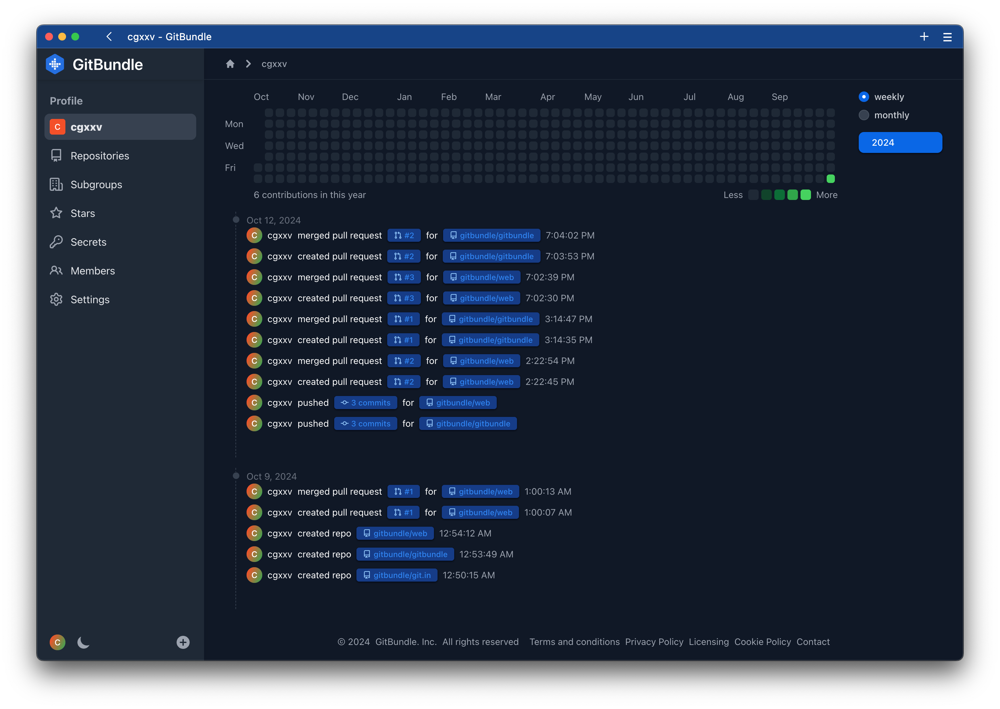

# GitBundle

GitBundle is a modern DevOps service. Which is based on git, built with Golang, Docker, K8s, Svelte, Tailwind ...

The target for GitBundle is to make everything become more efficient and easy for DevOps.




## A Simple Config

```console
GITBUNDLE_APP_NAME="GitBundle"
GITBUNDLE_DEBUG=true

# Some names are limited because of GitBundle needed
GITBUNDLE_USER_ADMIN_UID=root
GITBUNDLE_USER_ADMIN_EMAIL=root@example.com
# The super admin user password, admin pages are coming soon
GITBUNDLE_USER_ADMIN_PASSWORD=root

GITBUNDLE_GIT_ROOT=/data/gitbundle
GITBUNDLE_BLOBSTORE_BUCKET=/data/gitbundle/blob

# Default database is sqlite3, also supports mysql postgres
GITBUNDLE_DATABASE_DEBUG=false
GITBUNDLE_DATABASE_DRIVER=sqlite3
GITBUNDLE_DATABASE_DATASOURCE=database.sqlite3
```

## GOPRIVATE Configuration

1. Add `id_rsa.pub` in your GitBundle account.

2. Exec the following script, use your own domain

```bash
# Set GOPRIVATE env
go env -w GOPRIVATE=gitbundle.com
# Rewrite `go get` with ssh protocol
git config --global url."git@gitbundle.com:".insteadOf "https://gitbundle.com/"
```

3. If you need to configure ssh for GitBundle singlly

```console
# ~/.ssh/config
Host gitbundle.com
    HostName gitbundle.com
    User git
    IdentityFile ~/.ssh/gitbundle/id_rsa
```

4. Test ssh, this is necessary for `go get`, as `go get` does not provide a prompt for asking your agreement.

```bash
ssh -T git@gitbundle.com -p 22
```
